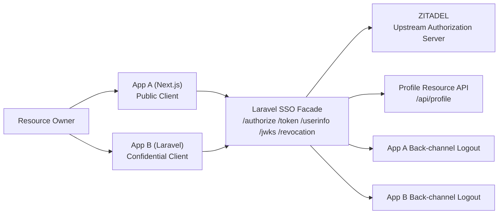
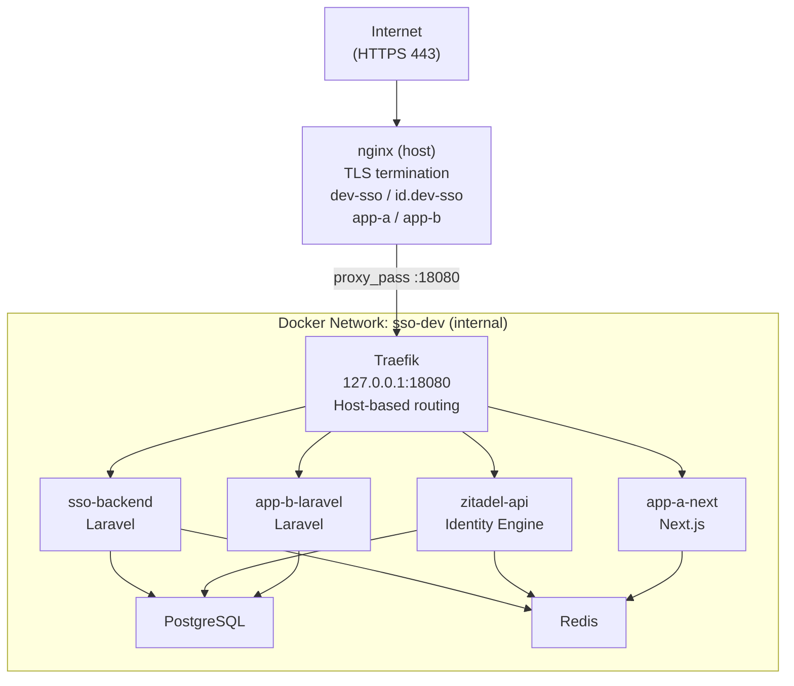

# Arsitektur Prototype SSO

## Referensi yang dipakai

- `docs/PRD_SSO.pdf`
- `docs/PRD_SSO_02042026.pdf`
- `docs/sso_rfc6749.txt.pdf`

## Prinsip desain

- ZITADEL menjadi identity engine dan source of truth untuk kredensial.
- Laravel `services/sso-backend` menjadi OIDC facade, token signer lokal, session coordinator, dan bridge ke ZITADEL.
- App A dan App B tidak menyimpan password user; keduanya hanya menyimpan sesi lokal aplikasi.
- Semua client memakai Authorization Code Flow + PKCE.
- Back-channel logout disinkronkan menggunakan logical `sid` yang konsisten lintas client.

## Topologi Runtime

## Topologi Dev Deployment

## Boundary Sistem

### 1. Upstream Authorization Server

- Engine: ZITADEL
- Tanggung jawab: autentikasi utama, MFA, brute-force protection, session pusat, dan upstream token issuance

### 2. Downstream OIDC Facade

- Stack: Laravel 12
- Tanggung jawab:
  - discovery document dan JWKS
  - endpoint `/authorize`, `/token`, `/userinfo`, `/revocation`
  - broker callback ke ZITADEL
  - local token issuance dengan ES256
  - refresh token rotation
  - registrasi sesi client untuk back-channel logout
  - centralized logout berbasis logical `sid`

### 3. Resource Server

- Stack: Laravel 12 pada service yang sama
- Tanggung jawab:
  - melayani `GET /api/profile`
  - memvalidasi local access token
  - mengekspos profil sinkron dan login context

### 4. App A

- Stack: Next.js
- Tanggung jawab:
  - dummy public client
  - callback exchange tanpa client secret
  - menyimpan sesi lokal di Redis
  - menerima signed logout token di `/api/backchannel/logout`

### 5. App B

- Stack: Laravel 12
- Tanggung jawab:
  - dummy confidential client
  - callback exchange dengan client secret
  - menyimpan sesi lokal di database session Laravel
  - menerima signed logout token di `/auth/backchannel/logout`

## Penyimpanan dan State

- PostgreSQL menyimpan user sinkron, login context, refresh token rotation, dan session App B.
- Redis menyimpan auth request Laravel SSO, authorization code sementara, access token revocation index, logical `sid`, dan local session App A.
- Logical `sid` dipetakan per subject agar beberapa app dapat berbagi satu sesi logout domain.

## Bootstrap ZITADEL Dev

Script `infra/zitadel/bootstrap-dev-resources.sh` menjalankan provisioning idempotent:

1. Membaca admin PAT dari volume bootstrap ZITADEL.
2. Verifikasi PAT valid via `/management/v1/orgs/me`.
3. Membuat atau menemukan project `Prototype SSO Dev`.
4. Membuat atau menemukan broker OIDC app `Prototype SSO Broker` (Web app, auth code + refresh token, POST auth method).
5. Menulis `client_id` dan `client_secret` yang benar ke `.env.dev`.
6. Membuat test human user `dev@timeh.my.id` jika belum ada.
7. Me-recreate `sso-backend` agar mengambil credential baru.
8. Smoke test authorize → ZITADEL redirect.

## Rencana Fase

- Phase 1: setup modular, strict typing, docker orchestration, Helm scaffold
- Phase 2: implementasi OIDC facade, broker callback ke ZITADEL, local token issuance, userinfo, jwks, revocation, dan resource API
- Phase 3: integrasi end-to-end App A dan App B, local session persistence, session registration, dan back-channel logout lintas aplikasi
- Phase 4: deployment dev server, HTTPS publik via nginx + certbot, Traefik loopback proxy, ZITADEL dev bootstrap (project, broker app, test user), dan full smoke test
