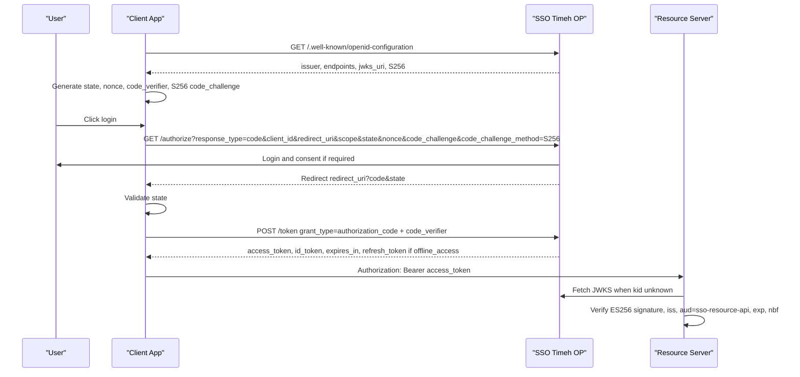

# Developer SSO Reference

Dokumen ini adalah indeks integrasi untuk aplikasi pihak ketiga yang memakai SSO Timeh sebagai OpenID Provider. Mulai dari discovery, jangan hardcode endpoint selain untuk bootstrap awal.

Base production saat ini: `https://api-sso.timeh.my.id`

Discovery otoritatif: `https://api-sso.timeh.my.id/.well-known/openid-configuration`

## Navigasi

| Kebutuhan | Dokumen |
|---|---|
| Registrasi client, public vs confidential, contoh Next.js dan Laravel | [Client Web App Onboarding](../onboarding/client-web-app-onboarding.md) |
| Kontrak endpoint OIDC/OAuth per parameter, response, dan error | [API Reference](api-reference.md) |
| Scope, claim, `/userinfo`, ID token, access token | [Scopes and Claims](scopes-and-claims.md) |
| Error OAuth, `error_ref`, `request_id`, FAQ integrasi | [Errors and FAQ](errors.md) |
| PKCE wajib, TTL, refresh rotation, rate limit, JWKS | [Security Model](security-model.md) |
| Validasi access token di API/resource server | [Resource Server Guide](resource-server.md) |

## Flow Authorization Code + PKCE



## Hal yang wajib diketahui

1. `openid` wajib pada setiap request `/authorize`.
2. PKCE `S256` wajib untuk semua client, termasuk confidential client.
3. `state` dan `nonce` wajib. Simpan sementara di server/session browser dan validasi saat callback.
4. Access token adalah JWT ES256 dengan `aud = sso-resource-api`. Jangan pakai ID token sebagai kredensial API.
5. Refresh token hanya terbit bila scope `offline_access` diminta dan client memang diizinkan memegang scope itu.
6. Token endpoint boleh dipakai oleh public client tanpa secret, tetapi PKCE tetap wajib.

Portal pengguna dan panel admin first-party memakai pola BFF: keduanya adalah
`confidential` client, menyimpan secret hanya di runtime server, dan tetap wajib
menggunakan PKCE `S256`. Jangan pernah mengekspos secret BFF melalui env `VITE_*`
atau bundle browser.

## Contoh Python dengan Authlib dan PKCE

Contoh ini hanya skeleton. Simpan `code_verifier`, `state`, dan `nonce` di session server atau storage sementara yang terlindungi.

```python
from authlib.integrations.requests_client import OAuth2Session
from authlib.common.security import generate_token
import base64
import hashlib

issuer = "https://api-sso.timeh.my.id"
client_id = "your-client-id"
redirect_uri = "https://app.example.com/auth/callback"

code_verifier = generate_token(64)
challenge = hashlib.sha256(code_verifier.encode("ascii")).digest()
code_challenge = base64.urlsafe_b64encode(challenge).rstrip(b"=").decode("ascii")

state = generate_token(32)
nonce = generate_token(32)

client = OAuth2Session(client_id=client_id, redirect_uri=redirect_uri, scope="openid profile email")
authorization_url, state = client.create_authorization_url(
    f"{issuer}/authorize",
    state=state,
    nonce=nonce,
    code_challenge=code_challenge,
    code_challenge_method="S256",
)

# Redirect user to authorization_url.
# On callback, validate state, then exchange the code:
token = client.fetch_token(
    f"{issuer}/token",
    code="code-from-callback",
    code_verifier=code_verifier,
    client_id=client_id,
)
```

Library OAuth yang tidak membuat `code_verifier` dan `code_challenge_method=S256` tidak kompatibel dengan OP ini. Gunakan library OIDC/OAuth yang mendukung PKCE, seperti `openid-client` atau `authlib`.
