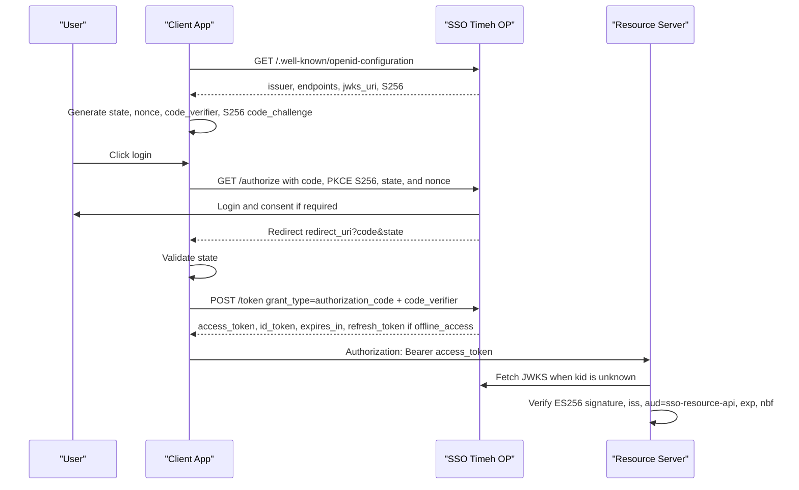

# Developer SSO Reference

This is the integration index for third-party applications using SSO Timeh as their OpenID Provider. Start with discovery and do not hardcode endpoints beyond the initial bootstrap.

Production issuer: `https://api-sso.timeh.my.id`

Authoritative discovery: `https://api-sso.timeh.my.id/.well-known/openid-configuration`

## Navigation

| Need | Document |
|---|---|
| Client registration and public versus confidential selection | [Client Web App Onboarding](../../onboarding/en/client-web-app-onboarding.md) |
| OAuth/OIDC endpoint contracts | [API Reference](api-reference.md) |
| Scopes, claims, UserInfo, and token roles | [Scopes and Claims](scopes-and-claims.md) |
| OAuth errors and support references | [Errors and FAQ](errors.md) |
| Mandatory PKCE, token TTLs, rotation, and JWKS | [Security Model](security-model.md) |
| Access token validation for APIs | [Resource Server Guide](resource-server.md) |
| Laravel confidential client | [Laravel Integration](integrations/laravel.md) |
| Next.js route-handler BFF | [Next.js Integration](integrations/nextjs.md) |
| Vue.js public SPA | [Vue.js Integration](integrations/vuejs.md) |
| Express confidential client | [Express Integration](integrations/express.md) |

## Authorization Code + PKCE Flow



## Required Knowledge

1. `openid` is required on every `/authorize` request.
2. PKCE `S256` is mandatory for every client, including confidential clients.
3. `state` and `nonce` are mandatory and must be validated at callback.
4. Access tokens are ES256 JWTs with `aud = sso-resource-api`. Never use an ID token as an API credential.
5. A refresh token is issued only when `offline_access` is requested and allowed.
6. Public clients can call the token endpoint without a secret, but PKCE remains mandatory.

The first-party portal and admin panel use the **confidential BFF + PKCE S256** pattern. Their secrets and tokens remain in server runtime; browsers receive same-origin session cookies only.

## Python Skeleton with Authlib

```python
from authlib.integrations.requests_client import OAuth2Session
from authlib.common.security import generate_token
import base64
import hashlib

issuer = "https://api-sso.timeh.my.id"
client_id = "your-client-id"
redirect_uri = "https://app.example.com/auth/callback"

code_verifier = generate_token(64)
challenge = hashlib.sha256(code_verifier.encode("ascii")).digest()
code_challenge = base64.urlsafe_b64encode(challenge).rstrip(b"=").decode("ascii")

state = generate_token(32)
nonce = generate_token(32)

client = OAuth2Session(client_id=client_id, redirect_uri=redirect_uri, scope="openid profile email")
authorization_url, state = client.create_authorization_url(
    f"{issuer}/authorize",
    state=state,
    nonce=nonce,
    code_challenge=code_challenge,
    code_challenge_method="S256",
)

token = client.fetch_token(
    f"{issuer}/token",
    code="code-from-callback",
    code_verifier=code_verifier,
    client_id=client_id,
)
```

OAuth libraries that cannot produce a verifier and `code_challenge_method=S256` are incompatible with this provider.
