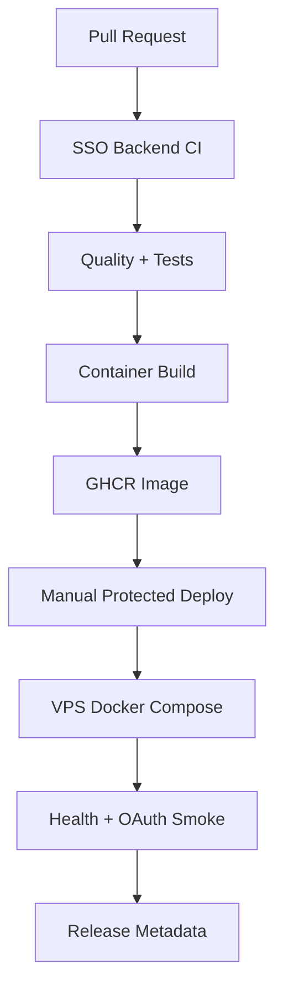

# SSO Backend CI/CD Model

This document defines the production DevOps model for `services/sso-backend`.

## Goal

Ship the SSO Backend as a secure, reproducible, and observable Laravel Passport OAuth2 server using:

```text
PHP 8.4
Laravel 13
Laravel Passport 13
Laravel Octane
FrankenPHP
Docker / Compose
GitHub Actions
GHCR
VPS over SSH
```

## Pipeline Layers



## CI Workflow

Workflow:

```text
.github/workflows/sso-backend-ci.yml
```

Triggers:

- Pull requests touching backend/runtime/deploy files.
- Push to `main` touching backend/runtime/deploy files.
- Manual dispatch.

Jobs:

| Job | Purpose | Blocking |
|---|---|---:|
| `quality` | Composer validation, Pint, advisory PHPStan | Pint blocks, PHPStan advisory |
| `tests` | Targeted Auth/OAuth + full Pest suite | Yes |
| `container` | Build FrankenPHP image, SBOM, provenance | Yes |

PHPStan is advisory for now because existing Pest helper typing still causes known false positives.

## Image Tagging

Image registry:

```text
ghcr.io/leavend/sso-kali/sso-backend
```

Tags:

| Tag | Meaning |
|---|---|
| `sha-xxxxxxx` | Immutable commit image |
| `main` | Latest main branch image |
| `manual` | Manual dispatch image |

Production should prefer immutable `sha-*` tags.

## Deployment Workflow

Workflow:

```text
.github/workflows/sso-backend-deploy.yml
```

Trigger:

```text
workflow_dispatch only
```

Inputs:

| Input | Meaning |
|---|---|
| `image_tag` | GHCR image tag to deploy |
| `dry_run` | Validate SSH + compose config only |
| `run_smoke` | Run post-deploy backend smoke |

The workflow uses GitHub Environments for production approval gates.

## Required GitHub Secrets

```text
VPS_HOST
VPS_USER
VPS_SSH_KEY
VPS_SSH_PORT
VPS_PROJECT_DIR
VPS_ENV_PROD
```

`VPS_ENV_PROD` should contain the production `.env.prod` contents.

Do not store secrets in the repository.

## VPS Runtime Contract

Expected files on VPS:

```text
/opt/sso-backend-prod/docker-compose.main.yml
/opt/sso-backend-prod/.env.prod
/opt/sso-backend-prod/scripts/vps-deploy-main.sh
/opt/sso-backend-prod/scripts/sso-backend-vps-smoke.sh
```

Expected services:

```text
postgres
redis
sso-backend
```

The backend container uses its Dockerfile entrypoint. Compose must not override the command.

## Deploy Phases

```text
1. SSH preflight
2. Sync deploy assets
3. Optional env install
4. Compose config validation
5. Pull image
6. Start postgres/redis
7. Run migrations
8. Start sso-backend
9. Wait for health
10. Smoke endpoints
11. Emit release metadata
```

## Smoke Test Contract

Required endpoints:

```text
GET /up
GET /health
GET /.well-known/openid-configuration
GET /.well-known/jwks.json
```

Expected status:

```text
200 OK
```

Operator smoke command:

```bash
scripts/sso-backend-vps-smoke.sh \
  --host <vps-host> \
  --user <vps-user> \
  --port 22 \
  --project-dir /opt/sso-backend-prod
```

## Rollback Model

Rollback target should be an immutable previous image tag:

```text
sha-previous
```

Rollback steps:

1. Run deploy workflow with previous `image_tag`.
2. Keep DB unchanged unless a migration rollback is explicitly planned.
3. Verify smoke endpoints.
4. Review container logs.

## Security Principles

- No secrets committed.
- SSH key stored in GitHub Secrets.
- Production deploy uses environment protection.
- Image provenance and SBOM generated in CI.
- Health checks fail closed.
- Migrations run explicitly during deploy, not container boot.
- Backend deploy workflow is manual until confidence is high.

## Known Exceptions

- Existing monorepo workflows remain for compatibility.
- PHPStan is advisory until Pest helper bootstrap typing is remediated.
- Full frontend/admin deployment remains outside this backend-focused model.
